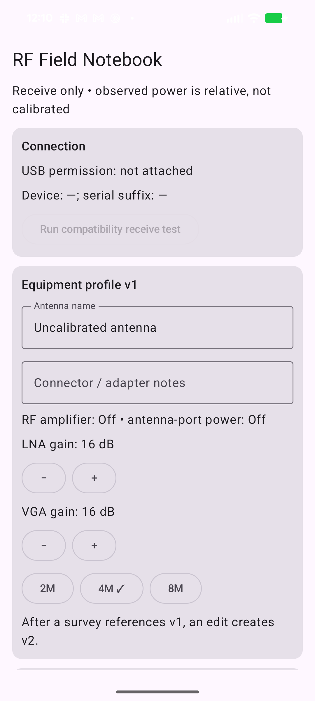

# M1 UI review

Status: Initial setup/empty state reviewed; refreshed setup plus active and summary states pending radio run

The initial M1 setup screen was installed and rendered on the Pixel 8a running Android
17 on 2026-09-14. The first capture exposed status-bar overlap caused by
edge-to-edge layout. The root content now applies status- and navigation-bar
insets; the recaptured screen confirms that the title, disconnected state,
receive-only calibration warning, equipment fields, fixed power defaults, gain
controls, and sample-rate choices are readable without overlap.

The screen uses text labels in addition to selection marks and does not encode
status in color alone. Since this capture, editable multiple/excluded ranges,
revisit/threshold/minimum-bandwidth fields, and expanded health details were
added. A refreshed setup capture and active/completion evidence will be added
during the production HackRF gate; this image is retained as evidence of the
inset correction, not as the final UI claim.
